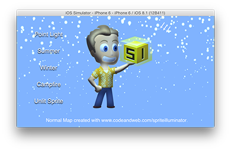
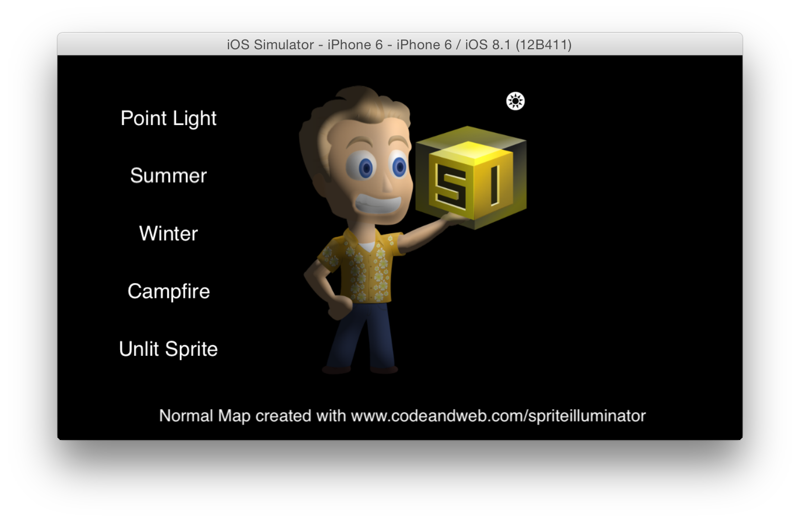
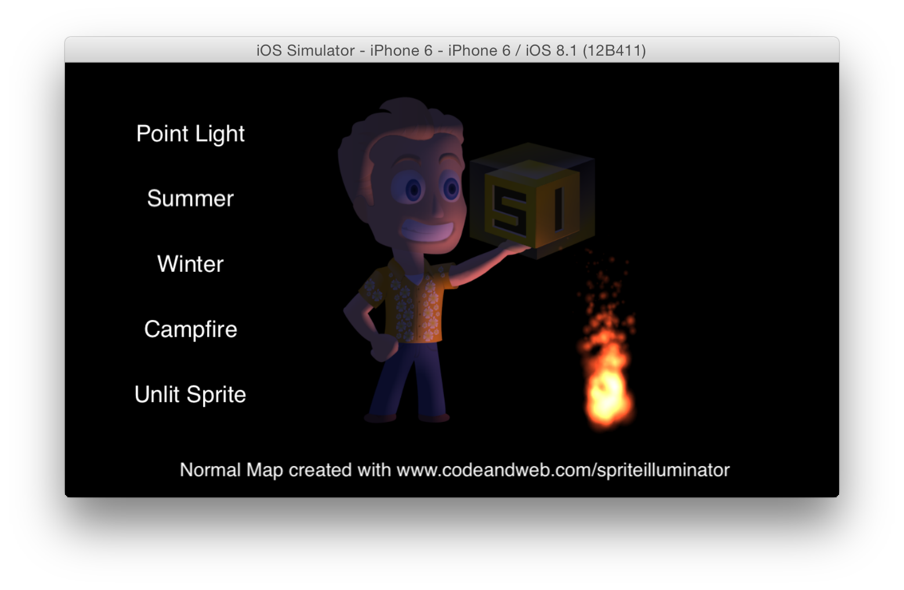

# Dynamic Lighting Demo for Cocos2D with Normal Maps

This demo uses the same normal mapped sprite in different dynamic light scenarios.
The light source can be dragged do light the sprite from different angles.

Summer (Directional Light)

Winter (Directional Light + Particles)

Simple Point Light

Campfire (Point Light + Particles)

All light effects are calculated in real time using Cocos2D's lighting system.

## Normal Maps

A normal mapped sprite consists of 2 files:

Sprite's Texture

Sprite's Normal map

Generating a Normal Map for the sprite is easy using a [Normal Map Generator](https://www.codeandweb.com/normal-map-generator).
