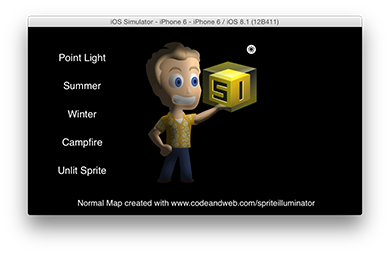
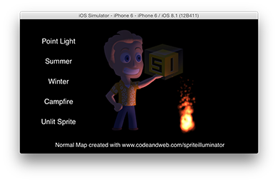

# Dynamic Lighting Demo for Cocos2D with Normal Maps

This demo uses the same normal mapped sprite in different dynamic light scenarios.
The light source can be dragged do light the sprite from different angles.

#### Summer scene

* Bright yellow directional light
* Bright ambient light

#### Winter scene

* Bright light blue directional light
* Bright light blue ambient light
* Snow particles (no light effect, just for the fun)

#### Point light scene

* White point light (restricted radius)
* Dark gray ambient light

#### Camp fire scene

* Orange point light (restricted radius)
* Dark blue ambient light
* Fire particles (no light effect, just for the fun)
* Animated ligth source position (flickering)

All light effects are calculated in real time using Cocos2D's lighting system.

## Normal Maps

A normal mapped sprite consists of 2 files:

Generating a Normal Map for the sprite is easy using a [Normal Map Generator](https://www.codeandweb.com/normal-map-generator).

